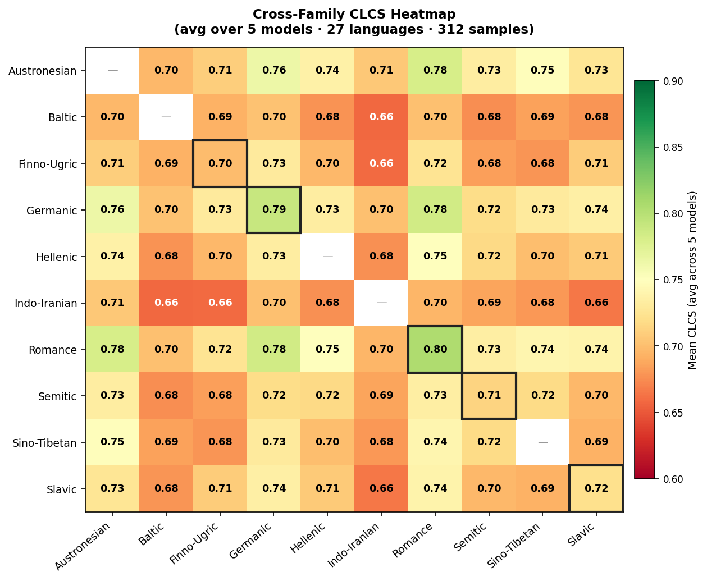

# Cross-Lingual Consistency of Sentiment (CLCS) Evaluation

Evaluates whether multilingual language models assign consistent sentiment labels
across 27 language translations of the same source text.
Introduces the Cross-Lingual Consistency Score (CLCS) and demonstrate that
a KL-divergence-based consistency penalty can lift XLM-R's cross-lingual agreement
by +9 pp in a single fine-tuning epoch.

> **Dataset:** Brand24/mms — 6.165 M rows, 28 languages, 3-class sentiment
> (negative / neutral / positive).
> **Scope:** 27 languages (English excluded as source), 312 shared source IDs,
> 351 language pairs per model.

---

## CLCS Metric

Hard (agreement-based) pairwise CLCS between two languages A and B over N parallel samples:

$$\text{CLCS}(A, B) = \frac{1}{N} \sum_{i=1}^{N} \mathbb{1}\bigl[\hat{y}_A^i = \hat{y}_B^i\bigr]$$

**Global CLCS** = mean over all $\binom{L}{2}$ language pairs:

$$\text{Global-CLCS} = \frac{1}{\binom{L}{2}} \sum_{A < B} \text{CLCS}(A, B)$$

**Family CLCS** = mean restricted to within-family pairs (Germanic, Romance, Slavic, …).

Cohen's κ is reported alongside CLCS as a robustness check that corrects for
chance agreement given marginal label distributions.

See [src/metrics/clcs.py](src/metrics/clcs.py) for the full implementation.

---

## Models

| Key | Type | HuggingFace identifier |
|---|---|---|
| `xlmr-base` | Transformer (fine-tuned) | `xlm-roberta-base` |
| `mbert` | Transformer | `nlptown/bert-base-multilingual-uncased-sentiment` |
| `mdeberta` | Transformer | `lxyuan/distilbert-base-multilingual-cased-sentiments-student` |
| `llama3.1` | LLM via Ollama | `llama3.1:8b` |
| `aya-expanse` | LLM via Ollama | `aya-expanse:8b` |

---

## Results

Fair cross-model evaluation: 27 shared languages, 312 common source IDs, 351 pairs.
All scores use the corrected (non-contaminated) evaluation split.

| Model | Global CLCS ↑ | Mean κ ↑ | Macro F1 ↑ |
|---|:---:|:---:|:---:|
| **xlmr-λ0.5-ep1** *(fine-tuned, best)* | **0.863** | — | — |
| xlmr-λ1.0-ep1 *(fine-tuned)* | 0.854 | — | — |
| xlmr-base *(baseline)* | 0.790 | 0.674 | 0.780 |
| aya-expanse-8B | 0.754 | 0.628 | 0.720 |
| mBERT | 0.733 | 0.526 | 0.467 |
| llama3.1-8B | 0.699 | 0.529 | 0.687 |
| mDeBERTa | 0.653 | 0.365 | 0.344 |

### Key findings

- **XLM-R dominates on both dimensions.** It achieves the highest Global CLCS (0.790)
  and Macro F1 (0.780) among all baselines, confirming that dedicated multilingual
  fine-tuning produces more cross-lingually coherent sentiment representations.
- **CLCS and accuracy can diverge.** mBERT achieves moderate consistency (0.733)
  despite low Macro F1 (0.467), suggesting it exploits language-specific label
  biases rather than learning genuinely transferable sentiment signals.
  mDeBERTa's distillation strategy hurts both metrics.
- **Consistency is a learnable objective.** A single-epoch fine-tune with the KL
  penalty at λ=0.5 lifts XLM-R CLCS from 0.790 → 0.863 (+9.2 pp) with no accuracy
  regression, demonstrating that cross-lingual consistency is separable from task accuracy.

---

## Practical Implications: Consistency vs. Accuracy

CLCS and Macro F1 measure different properties and should not be collapsed
into a single "quality" number:

- Macro F1 asks is the label right? — model prediction vs. gold.
- CLCS asks does the model treat the same meaning the same way across
  languages? — the model's predictions vs. each other, invariant to translation.

Because the two axes are orthogonal, every model falls into one of four regimes:

|                  | **Accurate**                                  | **Inaccurate**                                |
|------------------|-----------------------------------------------|-----------------------------------------------|
| **Consistent**   | Robust & reliable — the goal state            | Systematically wrong, but *uniformly* so      |
| **Inconsistent** | Right on average, but the average hides disparity | Worst case — wrong *and* erratic          |

The two off-diagonal cells are the ones that matter for deployment:

- **Consistent but not correct** (e.g. mBERT: CLCS 0.733, Macro F1 0.467).
  The model applies a stable but mistaken decision boundary uniformly across
  languages — here, exploiting language-specific label biases rather than
  transferable sentiment signal. This is the more tractable failure: no
  language community is disadvantaged relative to another, and a single
  systematic bias can be recalibrated. Crucially, consistency alone is
  gameable — a degenerate classifier that always predicts one class scores
  perfect CLCS while being useless — so CLCS is only meaningful when read
  jointly with accuracy.

- Accurate but inconsistent is the more deceptive failure, and the one
  standard leaderboards miss. A model can be correct in aggregate while
  diverging per language on identical content, because strong languages
  compensate for weak ones in the average. This is fundamentally a
  fairness/equity problem: in a deployed system (content moderation,
  feedback triage), the same complaint is flagged negative in one language and
  neutral in another. Aggregate accuracy never reveals this; CLCS does. Although
  no single model in our table is a clean example at the model level, this
  pattern appears sharply at the language-pair level — see the Bulgarian
  analysis below.

Why the XLM-R result matters under this framing. XLM-R shows the tightest
alignment between CLCS (0.790 → 0.863 fine-tuned) and Macro F1 (0.780). That
coupling is evidence its consistency is substantive — driven by genuine
language-invariant sentiment representation — rather than the degenerate,
majority-class consistency that inflates CLCS without accuracy. Models where the
two metrics decouple (mBERT, mDeBERTa) are consistent for the wrong reasons.


---


## Why Bulgarian Dominates the Worst Language Pairs

Bulgarian (bg) recurs across the lowest-CLCS pairs. Three explanations are
plausible, and in a translation-built benchmark they are confounded: because
the parallel corpus is generated with OPUS-MT, a poor en→bg translation breaks the
"same input" assumption, so an observed sentiment flip may reflect the
translation altering meaning rather than the model being inconsistent. We ran a
four-part diagnostic (`scripts/diagnose_bulgarian.py`,
[results/scores/bulgarian_diagnosis.json](results/scores/bulgarian_diagnosis.json))
to separate the causes.

**1. Native vs. translated — rules out a modeling deficit.**
XLM-R scores 0.842 Macro F1 on native Bulgarian text from Brand24/mms —
above the 0.780 corpus mean. The model represents Bulgarian sentiment perfectly
well. Performance only collapses on the translated split (mean pairwise
CLCS 0.694), so the failure is on the translation side, not in the model.

**2. Translation quality — bg is the single worst language.**
Reference-free round-trip chrF (OPUS-MT en→bg, then NLLB bg→en, scored against the
English source) gives bg 0.409 — dead last of all 27 languages (0th percentile).
Note: COMET-QE was unavailable offline, so round-trip chrF is used as the quality
proxy; it conflates forward and backward MT quality and is therefore corroborating
rather than definitive on its own.

**3. CLCS recovery under quality filtering — the causal evidence.**
Restricting to higher-quality translations lifts bg's consistency directly:
filtering above the 25th-percentile chrF cutoff yields +4.9 pp (0.694 → 0.743), and
above the 50th-percentile cutoff (156 samples) yields +9.0 pp (0.694 → 0.785) —
nearly matching the global CLCS mean of 0.790. Because removing the
lowest-quality translations alone recovers almost all of the gap, low translation
quality is causally responsible for Bulgarian's depressed CLCS.

**4. Flip type — consistent with hedging MT, not inversion.**
Across 514 disagreements in bg's five worst partners (hi, zh, he, sl, uk),
75.5% are neutral-drift (a one-step shift involving the neutral class) and only
24.5% are negation flips (pos↔neg). This is the signature of MT output that
softens or hedges sentiment rather than inverting it — again pointing to
translation, not modeling. Notably, two of the five worst partners (sl, uk) are
themselves Slavic, so bg pairs badly even within its own family, which localizes
the problem to the bg translation pipeline rather than a cross-family effect.

**Verdict.** Bulgarian's appearance in the worst pairs is driven primarily by
OPUS-MT translation quality, not by language-specific modeling difficulty. This
is a benchmark-construction limitation rather than a model failure — and it
illustrates exactly why a translation-built cross-lingual benchmark must report a
translation-quality control. A controlled re-translation (e.g. NLLB-200 forward, or
human-verified bg references) is the natural next step.


---


## Language-Family Heatmap



*Each cell shows the mean intra-family CLCS for a given model. Germanic and Romance
language families consistently achieve the highest within-family agreement across all
models; Semitic and Japonic families show the most cross-model variance.*

---

## Repository structure

```
clcs-eval/
├── configs/
│   └── experiment.yaml            # All run parameters (seed, splits, λ sweep …)
├── data/
│   ├── raw/                       # Brand24/mms parquet cache (git-ignored)
│   └── processed/                 # Parallel corpus CSVs (git-ignored, reproducible)
├── notebooks/
│   └── 01_eda.ipynb               # Exploratory data analysis
├── results/
│   ├── checkpoints/               # Per-epoch model checkpoints (git-ignored)
│   ├── figures/                   # PNG plots (committed)
│   └── scores/                    # CLCS score CSVs and JSON summaries (committed)
├── scripts/
│   ├── build_parallel_corpus.py   # Step 1 — build translation corpus
│   ├── run_inference.py           # Step 2 — run all models × all languages
│   ├── compute_clcs.py            # Step 3 — compute CLCS scores
│   └── train_consistency.py       # Step 4 — consistency fine-tuning
├── src/
│   ├── data/
│   │   ├── loader.py              # Brand24/mms loading & language-family map
│   │   └── parallel.py            # OPUS-MT translation pipeline
│   ├── metrics/
│   │   └── clcs.py                # CLCS, pairwise kappa, matrix, family helpers
│   ├── models/
│   │   ├── inference.py           # SentimentInference class & MODEL_REGISTRY
│   │   └── llm_inference.py       # LLMInference class (Ollama)
│   ├── training/
│   │   └── finetune.py            # fine_tune_sentiment / fine_tune_consistency
│   └── visualization/
│       └── plots.py               # Heatmap, bar chart, model-comparison figures
└── tests/
    └── test_clcs.py               # pytest unit tests (28 tests)
```

---

## Setup

```bash
git clone <repo-url> && cd clcs-eval
python3 -m venv .venv && source .venv/bin/activate
pip install -r requirements.txt

# HuggingFace token — required for the gated Brand24/mms dataset
cp .env.example .env          # then fill in HF_TOKEN in .env
```

---

## Full pipeline walkthrough

### Step 1 — Build the parallel corpus

Downloads Brand24/mms, samples 500 English source texts
(confidence-filtered, stratified by label), translates via OPUS-MT into 26 target
languages, and saves to `data/processed/`.

```bash
python scripts/build_parallel_corpus.py \
    --n 500 \
    --batch-size 16 \
    --seed 42 \
    --confidence-threshold 0.85
```

> Restart-safe: interrupted runs resume from `data/processed/parallel_checkpoint.json`.

### Step 2 — Run inference

```bash
# Transformer models (mBERT, XLM-R base, mDeBERTa)
python scripts/run_inference.py --batch-size 32 --max-length 128

# LLM baselines — requires Ollama running locally
python scripts/run_inference.py --models llama3.1 aya-expanse
```

### Step 3 — Compute CLCS scores

```bash
# Fair cross-model evaluation (27 shared languages, 312 common source IDs)
python scripts/compute_clcs.py --corrected
```

Outputs land in `results/scores/`.

### Step 4 — Consistency fine-tuning (XLM-R)

Requires the warm-start checkpoint in `models/xlmr-base_sentiment/` and the split
corpus files in `data/processed/`.

```bash
# λ=0.5 sweep (best result: epoch 1, Global CLCS = 0.863)
python scripts/train_consistency.py --lambda 0.5 --max-ce-rows 500000
```

---

## Data contamination note

An early training run (`results/checkpoints/xlmr_lambda0.5_contaminated/`) used the
same parallel corpus for both KL training and CLCS evaluation, inflating val_clcs by
~0.21. It is retained for reproducibility only and must **not** be used for reporting.
All reported results use the corrected checkpoints.

---

## Run tests

```bash
pytest tests/ -v   # 28 tests
```

---

## References & Acknowledgements

### Dataset
- Brand24/mms — Multilingual Social Media Sentiment, 28 languages. https://huggingface.co/datasets/Brand24/mms

### Pre-trained Models
- XLM-R — Conneau et al. (2020). ACL 2020. https://arxiv.org/abs/1911.02116
- mBERT — Devlin et al. (2019). NAACL-HLT. https://arxiv.org/abs/1810.04805
- DeBERTaV3 — He et al. (2021). ICLR 2021. https://arxiv.org/abs/2111.09543
- DistilBERT — Sanh et al. (2019). https://arxiv.org/abs/1910.01108
- Helsinki-NLP OPUS-MT — Tiedemann & Thottingal (2020). EAMT 2020. https://aclanthology.org/2020.eamt-1.61/

### Libraries
- HuggingFace Transformers & Datasets — Wolf et al. (2020); Lhoest et al. (2021).
- PyTorch — Paszke et al. (2019). https://arxiv.org/abs/1912.01703
- NumPy — Harris et al. (2020). Array programming with NumPy. Nature, 585, 357–362. https://doi.org/10.1038/s41586-020-2649-2
- SciPy — Virtanen et al. (2020). SciPy 1.0: Fundamental algorithms for scientific computing in Python. Nature Methods, 17, 261–272. https://doi.org/10.1038/s41592-019-0686-2
- pandas — McKinney (2010). Data structures for statistical computing in Python. Proceedings of the 9th Python in Science Conference, 56–61. https://doi.org/10.25080/Majora-92bf1922-00a
- Matplotlib — Hunter (2007). Matplotlib: A 2D graphics environment. Computing in Science & Engineering, 9(3), 90–95. https://doi.org/10.1109/MCSE.2007.55
- seaborn — Waskom (2021). seaborn: statistical data visualization. Journal of Open Source Software, 6(60), 3021. https://doi.org/10.21105/joss.03021

### Related Work

Cross-Lingual Consistency

- Qi, Fernández & Bisazza (2023) — Cross-Lingual Consistency of Factual Knowledge in Multilingual Language Models. EMNLP 2023 (Outstanding Paper Award). https://aclanthology.org/2023.emnlp-main.658/
- Guo et al. (2025) — How Reliable is Multilingual LLM-as-a-Judge? Findings of EMNLP 2025. https://aclanthology.org/2025.findings-emnlp.587/

Multilingual Sentiment Benchmarks

- Augustyniak et al. (2023) — Massively Multilingual Corpus of Sentiment Datasets and Multi-faceted Sentiment Classification Benchmark.
- NeurIPS 2023 D&B Track. https://openreview.net/forum?id=7tMgzSvopH
- Muhammad et al. (2023) — AfriSenti: A Twitter Sentiment Analysis Benchmark for African Languages. EMNLP 2023. https://aclanthology.org/2023.emnlp-main.862/
- Chen et al. (2025) — Cross-lingual Multimodal Sentiment Analysis for Low-Resource Languages via Language Family Disentanglement and Rethinking Transfer. Findings of ACL 2025. https://aclanthology.org/2025.findings-acl.338/

Cross-Lingual Transfer & LLM Evaluation

- Asai et al. (2024) — BUFFET: Benchmarking Large Language Models for Few-Shot Cross-Lingual Transfer. NAACL 2024. https://aclanthology.org/2024.naacl-long.100/
- Wang et al. (2023) — GradSim: Gradient-Based Language Grouping for Effective Multilingual Training. EMNLP 2023. https://aclanthology.org/2023.emnlp-main.282/
- Šmíd et al. (2025) — LACA: Improving Cross-Lingual Aspect-Based Sentiment Analysis with LLM Data Augmentation. ACL 2025. https://aclanthology.org/2025.acl-long.41/
